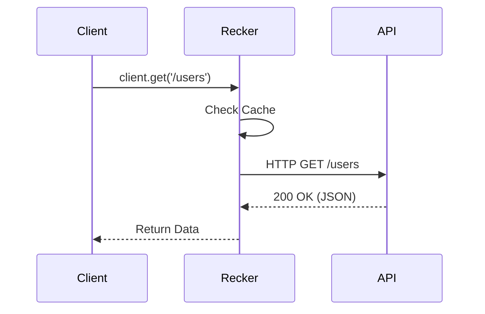

# Documentation Style Guide

To maintain "World-Class" quality documentation for Recker, we use extended features of Docsify. Please follow these guidelines when contributing.

## 1. Callouts & Alerts

Use flexible alerts to highlight important information. Don't just use bold text.

```markdown
> [!NOTE]
> Useful information that users should know.

> [!TIP]
> A helpful trick or shortcut.

> [!WARNING]
> Critical information that could cause errors or data loss.

> [!ATTENTION]
> Something that requires immediate attention.
```

**Renders as:**

> [!NOTE]
> Useful information that users should know.

> [!TIP]
> A helpful trick or shortcut.

> [!WARNING]
> Critical information that could cause errors or data loss.

## 2. Code Tabs

When showing configuration for different environments (e.g., `npm` vs `pnpm` or `TS` vs `JS`), use tabs.

```markdown
<!-- tabs:start -->

#### **npm**

```bash
npm install recker
```

#### **pnpm**

```bash
pnpm add recker
```

#### **yarn**

```bash
yarn add recker
```

<!-- tabs:end -->
```

## 3. Diagrams (Mermaid)

We support Mermaid diagrams natively. Use them to explain flows.

```markdown

```

## 4. Images

Images can be zoomed. Use standard Markdown syntax.

```markdown

```

## 5. Tone & Voice

*   **Direct & Action-Oriented:** "Install the package" instead of "You should install the package".
*   **Enthusiastic but Professional:** We are building a "World-Class" tool.
*   **Concise:** Avoid walls of text. Use bullet points and code snippets liberally.
