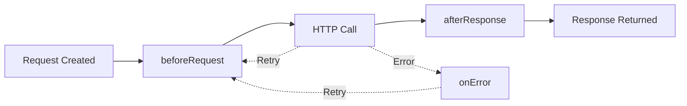
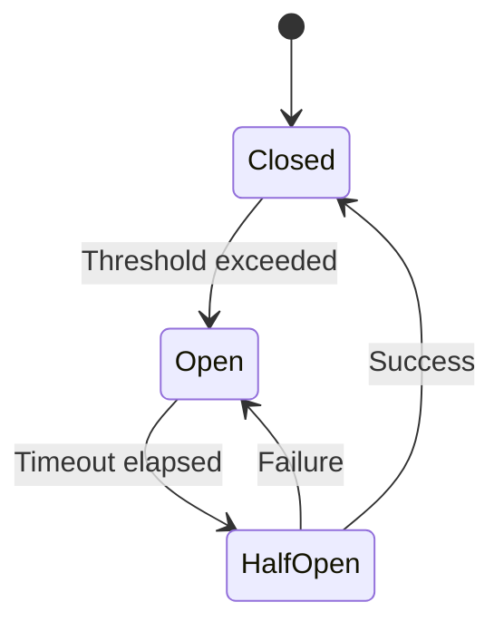
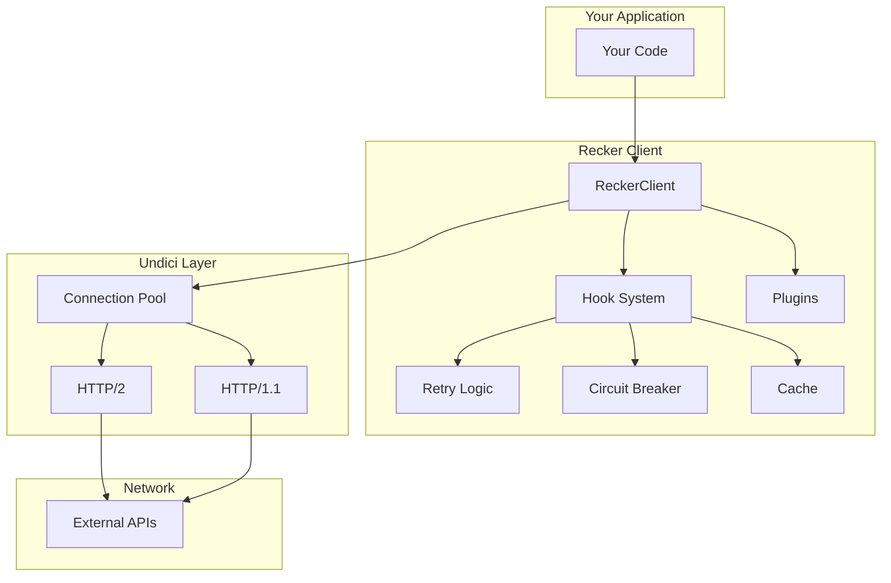

# Core Concepts

> Understanding Recker's architecture and design principles.

## Philosophy

Recker is built around three core principles:

1. **Resilience by Default** - Network failures happen. Recker helps you handle them gracefully.
2. **Observable by Nature** - Know what your HTTP client is doing without adding instrumentation.
3. **Composable & Extensible** - Use what you need, extend what you don't have.

## Key Concepts

### The Client

The `ReckerClient` is your main interface to HTTP operations. It manages:

- Connection pooling and reuse
- Global configuration (timeouts, retries, headers)
- Plugin registration
- Request lifecycle

```typescript
const client = recker({
  baseUrl: 'https://api.example.com',
  timeout: 5000,
  retry: { maxAttempts: 3 }
})
```

**Related:** [Client Configuration](/configuration/client-options.md) | [Quick Start](/getting-started/quickstart.md)

### Requests & Responses

Recker uses a request/response model built on Web standards (fetch API) with enhancements:

- **ReckerRequest** - Extends fetch Request with metadata, retry context, timing
- **ReckerResponse** - Extends fetch Response with convenience methods, parsed headers

```typescript
const response = await client.get('/users')
const data = await response.json()
```

**Related:** [Request/Response Guide](/guides/basics/request-response.md)

### Hooks & Lifecycle

Recker's hook system lets you intercept and modify requests at different stages:



**Hook Phases:**
- `beforeRequest` - Modify request before sending (auth, headers, logging)
- `afterResponse` - Process response before returning (parsing, caching)
- `onError` - Handle errors (logging, recovery, custom retry logic)

```typescript
client.hooks.beforeRequest.push(async (request) => {
  request.headers.set('Authorization', `Bearer ${token}`)
  return request
})
```

**Related:** [Hooks Guide](/guides/advanced/hooks.md) | [Plugin Development](/guides/plugins.md)

### Plugins

Plugins are reusable bundles of functionality that can:
- Add hooks
- Extend the client
- Provide new methods
- Configure defaults

```typescript
import { retry, cache, compression } from 'recker/plugins'

const client = recker({
  plugins: [
    retry({ maxAttempts: 3 }),
    cache({ ttl: 60000 }),
    compression()
  ]
})
```

**Related:** [Plugin Guide](/guides/plugins.md) | [Available Plugins](/guides/plugins.md#built-in-plugins)

### Retry Logic

Recker implements intelligent retry logic:

- **Idempotent by default** - GET, HEAD, OPTIONS, PUT, DELETE retry automatically
- **Exponential backoff** - Delays increase with each attempt (100ms → 200ms → 400ms)
- **Jitter** - Randomization prevents thundering herd
- **Configurable** - Override per-request or globally

```typescript
// Retry POST (non-idempotent) by opting in
await client.post('/orders', {
  body: orderData,
  retry: { maxAttempts: 3, methods: ['POST'] }
})
```

**Related:** [Retry Guide](/guides/advanced/retry.md) | [Retry Configuration](/configuration/advanced.md#retry)

### Circuit Breaker

The circuit breaker prevents cascading failures:

**States:**
- **Closed** - Normal operation, requests flow through
- **Open** - Too many failures, requests fail fast
- **Half-Open** - Testing if service recovered



```typescript
const client = recker({
  circuitBreaker: {
    threshold: 5,        // Open after 5 failures
    timeout: 60000,      // Try recovery after 60s
    resetTimeout: 30000  // Back to closed after 30s success
  }
})
```

**Related:** [Circuit Breaker Guide](/guides/advanced/circuit-breaker.md)

### Connection Pooling

Recker (via Undici) maintains connection pools to:
- Reuse TCP/TLS connections (reduces latency)
- Support HTTP/2 multiplexing (multiple requests per connection)
- Handle backpressure (queue requests when pool is full)

```typescript
const client = recker({
  pool: {
    maxConnections: 10,          // Per origin
    maxConcurrentStreams: 100,   // HTTP/2 streams per connection
    keepAliveTimeout: 4000       // Keep connections alive
  }
})
```

**Related:** [Connection Pooling Guide](/guides/performance/connection-pooling.md)

### Concurrency Control

Limit how many requests run in parallel:

```typescript
const client = recker({
  concurrency: {
    max: 5,              // Only 5 requests at a time
    queue: 100,          // Queue up to 100 waiting requests
    queueBehavior: 'fifo' // First in, first out
  }
})
```

**Related:** [Concurrency Guide](/guides/performance/concurrency.md)

### Type Safety

Recker provides full TypeScript support:

- **Generic responses** - Type your response data
- **Schema validation** - Validate with Zod at runtime
- **Type inference** - Automatic type narrowing

```typescript
interface User {
  id: number
  name: string
}

// Type-safe response
const response = await client.get<User>('/users/1')
const user: User = await response.json()

// Runtime validation
import { z } from 'zod'

const UserSchema = z.object({
  id: z.number(),
  name: z.string()
})

const validated = await client
  .get('/users/1')
  .then(r => r.json())
  .then(UserSchema.parse)
```

**Related:** [TypeScript Configuration](/configuration/typescript.md)

### Observability

Recker provides rich observability out of the box:

- **Timing metrics** - DNS, TCP, TLS, request, response durations
- **Header parsing** - CDN detection, rate limits, cache info
- **Debug mode** - Detailed request/response logging
- **Error context** - Retry attempts, timing, request details in errors

```typescript
const response = await client.get('/api/data')

console.log({
  timing: response.timing,
  cdn: response.headers.cdn,
  rateLimit: response.headers.rateLimit,
  cacheStatus: response.headers.cacheStatus
})
```

**Related:** [Observability Guide](/guides/observability/observability.md) | [Header Parsing](/guides/observability/header-parsing.md)

### MCP (Model Context Protocol)

First-class support for Claude's Model Context Protocol:

- **SSE Streaming** - Server-Sent Events with auto-reconnect
- **Tool Calling** - Invoke MCP tools from your code
- **Resource Access** - Read resources via MCP
- **Prompt Templates** - Use MCP prompt templates

```typescript
import { MCPClient } from 'recker/mcp'

const mcp = new MCPClient({
  endpoint: 'http://localhost:3000/mcp',
  apiKey: process.env.MCP_API_KEY
})

await mcp.connect()
const tools = await mcp.listTools()
const result = await mcp.callTool('search', { query: 'HTTP client' })
```

**Related:** [MCP Guide](/guides/advanced/mcp.md) | [MCP Example](/examples/03-advanced-mcp-integration.ts)

## Architecture Diagram



## Design Patterns

### Builder Pattern
Client and request configuration use the builder pattern for fluent API:

```typescript
const response = await client
  .get('/users')
  .timeout(5000)
  .retry({ maxAttempts: 3 })
  .header('Accept', 'application/json')
  .send()
```

### Plugin Architecture
Extend functionality without modifying core code:

```typescript
// Custom plugin
const myPlugin = (client) => {
  client.hooks.beforeRequest.push(async (req) => {
    console.log(`Sending ${req.method} ${req.url}`)
    return req
  })
}

const client = recker({ plugins: [myPlugin] })
```

### Composition Over Inheritance
Combine features instead of extending classes:

```typescript
const client = recker({
  plugins: [
    retry(),
    cache(),
    compression(),
    circuitBreaker()
  ]
})
```

## Next Steps

Now that you understand the core concepts:

- **Start building** → [Quick Start](/getting-started/quickstart.md)
- **See examples** → [Examples](/examples/README.md)
- **Deep dive into guides** → [Guides](/guides/README.md)
- **Configure your client** → [Configuration Reference](/configuration/quick-reference.md)
